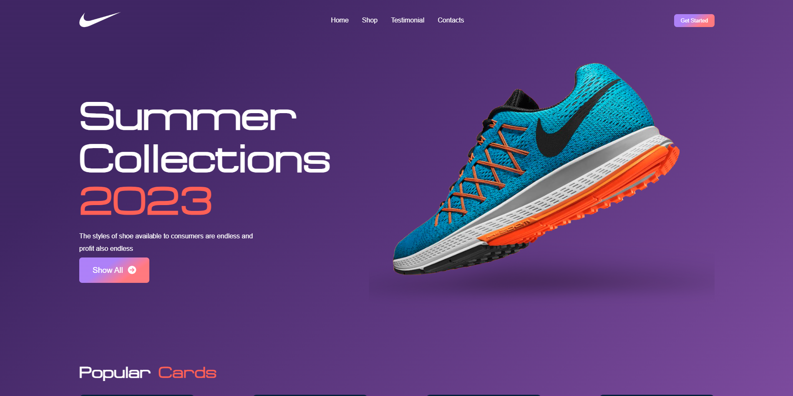
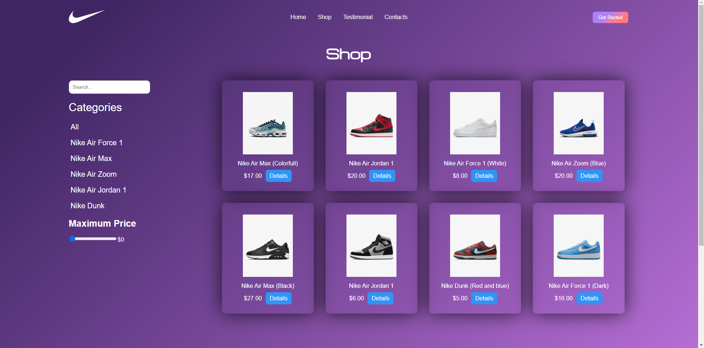
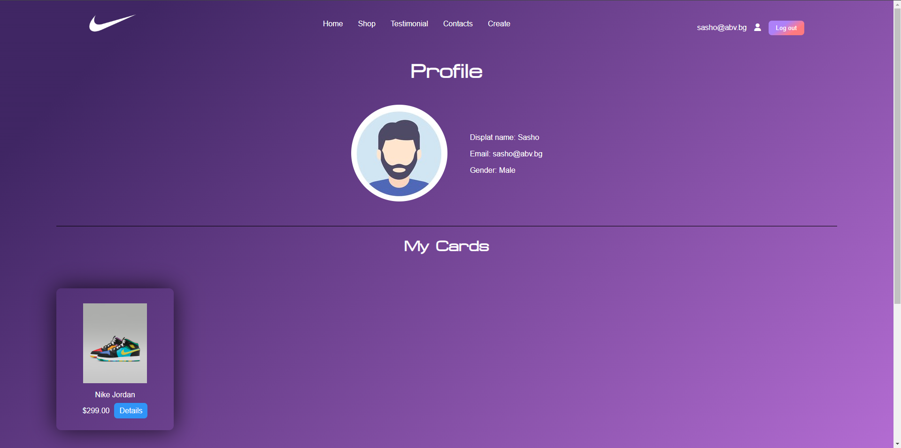
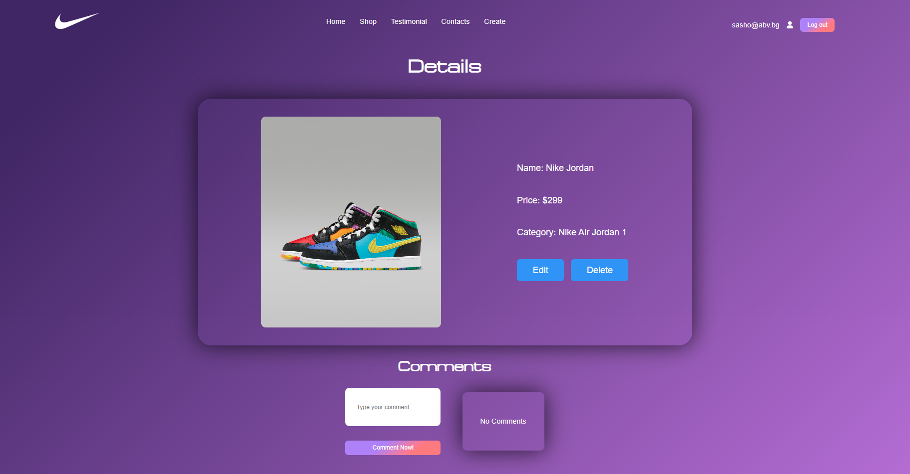

<h1 align="center" id="title">👟 Shoe-Website-Project 👟</h1>

<p align="center"></p>

<p id="description">This is a shoe website where you can see different branded shoes, see their rating and what other people think about the particular shoe. You can Sing-In or Sing-Up in order to create your own shoe card and share it with other people and friends. They wil be able to share their opinion in the comments section which is below your card. If you don't like something about your card you can always make changes and make it your way by editing it. You can add as many cards as you want and check all of them in your profile page so you won't lose track of your cards. The project shows my ability to work with more complex React project which includes different CRUD operations, the ability to navigate through different components and working with React-Context</p>

<h2>🚀 Demo</h2>

[https://shoe-website-k-y.netlify.app/](https://shoe-website-k-y.netlify.app/)

<h2>Project Screenshots:</h2>





 <br/>

  
  
<h2>🧐 Features</h2>

Here're some of the project's best features:

*   Sing-in and sing-up features
*   Live-time filtering
*   Creating editing and deleting cards
*   Shop-page and Profile-page

<h2>🛠️ Installation Steps:</h2>

<p>1. Clone the repository</p>

```
git clone https://github.com/Kalo116/Shoe-Website-project.git
```

<p>2. Enter the project folder</p>

```
cd .\Shoe-Website-project\
```

<p>3. Install all dependencies</p>

```
npm install
```

<p>4. Start the project</p>

```
npm start
```

  
  
<h2>💻 Built with</h2>

Technologies used in the project:

*   React
*   Firebase
*   SASS
*   React-Router-DOM
